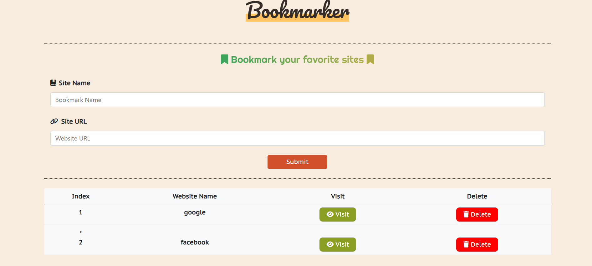

  

    
    
    
    
  

  <h3>📚 BOOKMARKER</h3>

**Bookmarker** is a simple and elegant web application that allows users to save, manage, and visit their favorite websites with ease. Built using **HTML**, **CSS**, **Bootstrap**, and **JavaScript**, this app stores bookmarks in the browser's **local storage**, providing a persistent experience without needing a backend.

## Live Demo

Try Bookmarker now: [Bookmarker-netlify](https://683f8e985737f430a864184b--melodious-sunflower-827495.netlify.app/)

## ✨ Features

- 🔖 Add and remove bookmarks  
- ✅ Input validation for name and URL  
- 🌐 Automatically formats URLs (adds `https://www.` if missing)  
- 💾 Local storage support (bookmarks are saved across sessions)  
- 🧭 Open bookmarked sites in a new tab  
- ❌ Modal popup for invalid submissions  
- 📱 Responsive design
